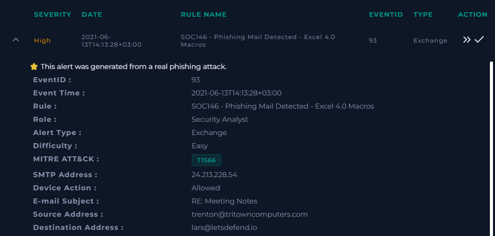
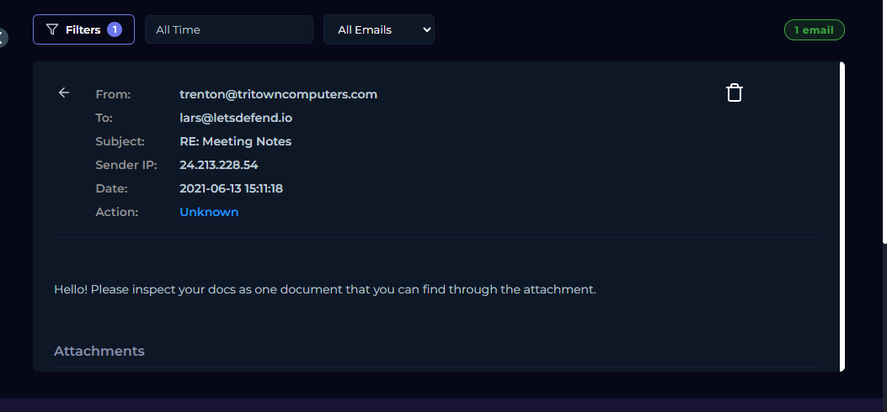
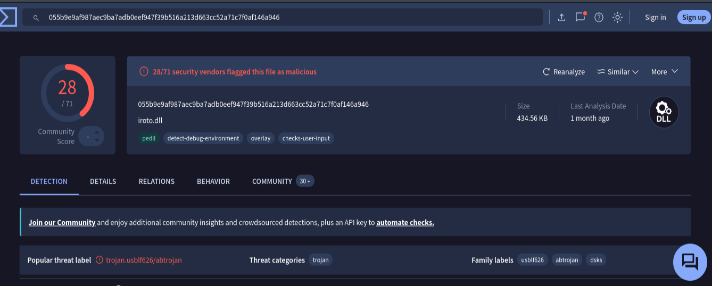
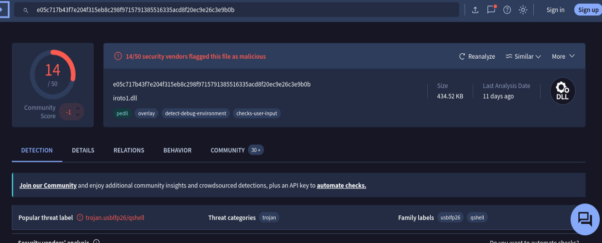
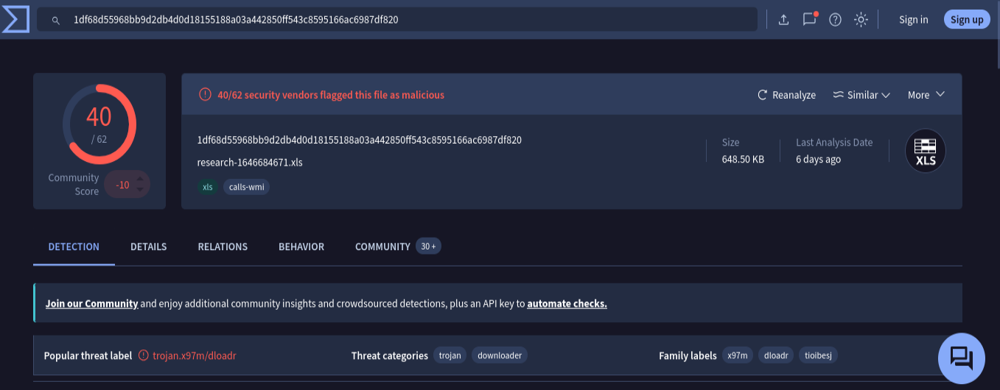
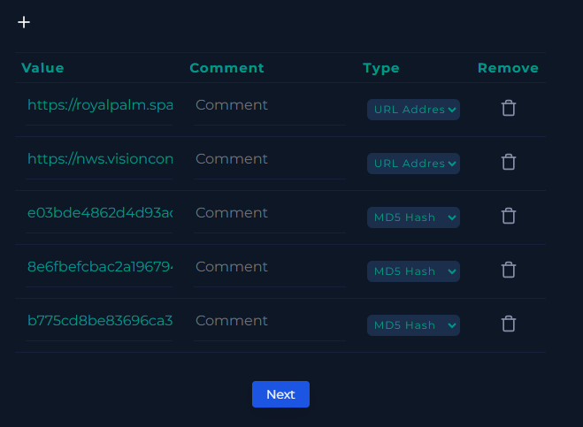
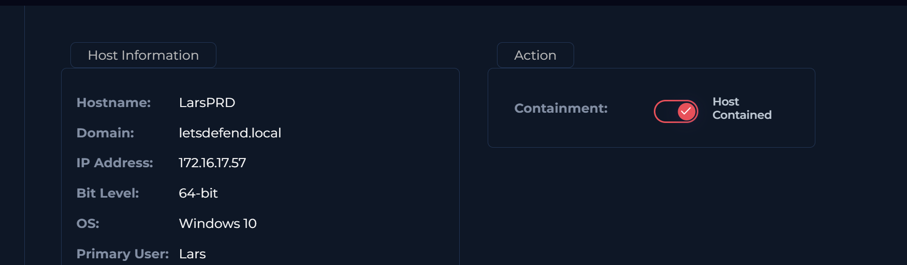
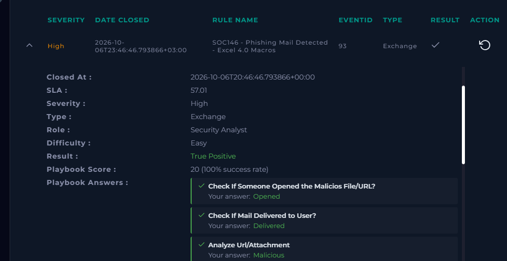

# SOC146 – Phishing Mail Detected – Excel 4.0 Macros

## Overview

This was a LetsDefend SOC alert related to a phishing email containing an Excel 4.0 macro.

The main goal of the investigation was to check the email, analyze the attachment, identify malicious artifacts, and determine whether the alert was a true positive.

**Final Verdict:** True Positive

---

## 1. Alert

The alert was generated with the following details:

* **Severity:** High
* **Event ID:** 93
* **Alert:** SOC146 - Phishing Mail Detected - Excel 4.0 Macros
* **Alert Type:** Exchange
* **MITRE ATT&CK:** T1566 - Phishing
* **Sender:** `trenton@tritowncomputers.com`
* **Recipient:** `lars@letsdefend.io`
* **Subject:** `RE: Meeting Notes`
* **Sender IP:** `24.213.228.54`
* **Device Action:** Allowed

### Screenshot



### Initial Observation

The alert was marked as **High severity** and was related to a phishing email containing an Excel 4.0 macro. Since the device action was **Allowed**, I continued the investigation to determine whether the email and attachment were actually malicious.

---

## 2. Email Security Analysis

I checked the email security details to understand the sender, recipient, subject, attachment, and message content.

**From:** `trenton@tritowncomputers.com`

**To:** `lars@letsdefend.io`

**Subject:** `RE: Meeting Notes`

**Sender IP:** `24.213.228.54`

The email contained an attachment and instructed the recipient to inspect a document.

### Screenshot



### Observation

The email appeared suspicious because it used a normal-looking subject, **"RE: Meeting Notes"**, while containing a potentially malicious document.

Since the alert specifically mentioned Excel 4.0 macros, I continued with file analysis.

---

## 3. VirusTotal Analysis

I checked the files in VirusTotal to determine whether they had already been identified as malicious.

### File 1

`e03bde4862d4d93ac2ceed85abf50b18`



The file was detected as malicious by VirusTotal.

### File 2

`8e6fbefcbac2a1967941fa692c82c3ca`



This file was also identified as malicious.

### File 3

`b775cd8be83696ca37b2fe00bcb40574`



The third artifact was also identified as malicious.

### Observation

The VirusTotal results provided additional evidence that the files associated with the email were malicious.

At this point, the alert was looking increasingly like a genuine phishing incident rather than a false positive.

---

## 4. Artifacts / IOCs

During the investigation, I identified the following file hashes:

```text
e03bde4862d4d93ac2ceed85abf50b18
8e6fbefcbac2a1967941fa692c82c3ca
b775cd8be83696ca37b2fe00bcb40574
```

I also found the following suspicious URLs:

```text
hxxps://royalpalm[.]sparkblue[.]lk/vCNhYrq3Yg8/dot.html
hxxps://nws[.]visionconsulting[.]ro/N1G1KCXA/dot.html
```

The URLs are defanged so they cannot be accidentally opened from the GitHub page.

### Screenshot



---

## 5. Endpoint Investigation

The attachment was confirmed to have been opened on the endpoint.

Because the malicious file had been executed, this was more serious than simply receiving a phishing email.

The affected endpoint was subsequently contained to prevent further potential activity.

### Screenshot



---

## 6. Final Analysis

Based on the investigation, I classified the alert as a:

**TRUE POSITIVE**

My reasoning was:

* The email was identified as a phishing attempt.
* The email contained a suspicious Excel attachment.
* The attachment was associated with Excel 4.0 macro activity.
* The files were identified as malicious through VirusTotal.
* Multiple malicious artifacts were identified.
* The attachment was opened on the endpoint.
* The affected endpoint was contained.

### Final Screenshot



---

## 7. MITRE ATT&CK

The alert mapped the activity to:

**T1566 – Phishing**

The phishing email was used as the initial delivery method for the malicious attachment.

---


This investigation showed how a phishing email can move from an email security alert to an endpoint security incident.

The email initially appeared to be a meeting-related message, but further investigation of the attachment and related artifacts confirmed malicious activity. The endpoint was subsequently contained, and the alert was classified as a **True Positive**.
